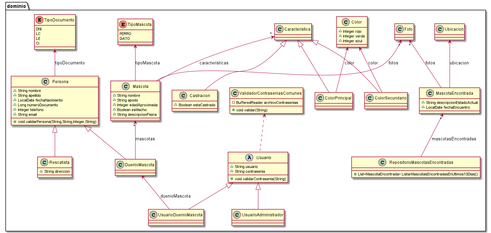

# TPA DDS 2021

## Diagrama de clases

<p align="center"> 

</p>

## Explicacion

* Para poder representar a las caracteristicas de las mascotas se eligio una lista de la clase abstracta
  "Caracacteristica". La idea es que englobe un tipo, asi toda clase que herede de Caracteristica 
  pueda meterse en esa lista. 
  Al momento de instanciar una Mascota, el administrador podría dejar 
  predefinido que elementos van a componer esa lista. Luego podría modificarla.
  

## Pseudocódigo

~~~
class Persona{
    String nombre;
    String apellido;
    LocalDate fechaNacimiento;
    TipoDocumento tipoDocumento;
    Integer numeroDocumento;   //Alcanza con Integer? SI
    Integer telefono;
    String email;
    
    Persona(String nombre, String apellido, LocalDate fechaNacimiento, TipoDocumento tipoDocumento, 
    Long numeroDocumento, Integer telefono, String email){
        
        this.validarPersona(nombre, apellido, telefono, email);
        
        this.nombre = nombre;
        this.apellido = apellido;
        this.fechaNacimiento = fechaNacimiento;
        this.tipoDocumento = tipoDocumento;
        this.numeroDocumento = numeroDocumento;
        this.telefono = telefono;
        this.email = email;
    }
    
    void validarPersona(String nombre, String apellido, Integer telefono, String email){
        if((nombre == null || apellido == null) && telefono == null && email == null){
            throw new PersonaInvalidaException("Debe ingresar como minimo <nombre y apellido>, <telefono> o <email>");
        }
    }
}

enum TipoDocumento{
    DNI, LC, LE, CI, PASAPORTE
}

class Mascota{
    TipoMascota tipoMascota      //permite agregar mas tipos a futuro. un loro por ejemplo?
    String nombre
    String apodo
    LocalDate fechaDeNacimientoAproximada
    Bool esMacho
    String descripcionFisica
    List<Foto> fotos        // clase Foto?? SI
    List<Caracteristica> caracteristicas    //en la interfaz grafica el administrador puede 
                                            //decidir que Caracteristicas poner en la lista antes de pasar la lista 
                                            //por el constructor de Mascota
    
    public Mascota(TipoMascota tipoMascota, String nombre, String apodo, LocalDate fechaDeNacimientoAproximada, 
                   Boolean esMacho, String descripcionFisica, List<Foto> fotos, List<Caracteristica> caracteristicas){
    this.tipoMascota = tipoMascota;
    this.nombre = nombre;
    this.apodo = apodo;
    this.fechaDeNacimientoAproximada = fechaDeNacimientoAproximada;
    this.esMacho = esMacho;
    this.descripcionFisica = descripcionFisica;
    this.fotos = fotos;
    this.caracteristicas = caracteristicas;
  }
    
    Integer calcularEdadAproximada(){
      return 0;
      //TODO
    }
}

enum TipoMascota{
    GATO, PERRO
}

class Foto{
}

class abstract Caracteristica{
    //abstracta o interface? No tenemos informacion suficiente para definirlo
    //lo dejo en abstract pero es provisorio
}

class ColorPrincipal extends Caracteristica{
    Color color
}

class ColorSecundario extends Caracteristica{
    Color color
}

class Castracion extends Caracteristica{
    Bool estaCastrado
}

class Color{
    Integer rojo
    Integer verde
    Integer azul
}

class Ubicacion{
}

class InformeMascotaEncontrada {

  UsuarioDuenioMascota duenioMascota;   //suponiendo que en el QR de la chapita esta este dato
                                        //asi el voluntario sabe a quien avisar mirando el informe
  List<Foto> fotos;
  String descripcionEstadoActual;
  Ubicacion lugarDeEncuentro;
  Persona rescatista;
  String direccionRescatista;
  LocalDate fechaDeEncuentro;

  InformeMascotaEncontrada(UsuarioDuenioMascota duenioMascota, List<Foto> fotos, String descripcionEstadoActual,
                                  Ubicacion lugarDeEncuentro, Persona rescatista, String direccionRescatista,
                                  LocalDate fechaDeEncuentro){
    
    this.validarInforme(fotos);
    
    this.duenioMascota = duenioMascota;
    this.fotos = fotos;
    this.descripcionEstadoActual = descripcionEstadoActual;
    this.lugarDeEncuentro = lugarDeEncuentro;
    this.rescatista = rescatista;
    this.direccionRescatista = direccionRescatista;
    this.fechaDeEncuentro = fechaDeEncuentro;

    this.agregarInformeAlRepositorio();
  }


//////////// 4to requerimiento 
class RepositorioMascotasEncontradas{

    //Deberia ser un singleton, no?

    List<MascotaEncontrada> mascotasEncontradas;
    
    List<MascotaEncontrada> ListarMascotasEncontradasEnUltimosDias(Integer dias){
        return this.mascotasEncontradas.filter(
        mascota -> mascota.getFechaEncuentro().isAfter(LocalDate.now().minusDays(dias))
        )
    }
    
    List<MascotaEncontrada> ListarMascotasEncontradasEnUltimos10Dias(){
        return ListarMascotasEncontradasEnUltimosDias(10);
    }
}

class Voluntario extends Usuario{

  Voluntario(String usuario, String contrasenia){
    super(usuario, contrasenia);
  }

  List<InformeMascotaEncontrada> obtenerInformesMascotasEncontradasDeUltimos10Dias(){
    return new RepositorioInformesMascotasEncontradas().ListarMascotasEncontradasEnUltimos10Dias();
  }

 //creo que igual por ahora no hace falta esto
  void confirmarAvisoAlDuenio(InformeMascotaEncontrada informeAProcesar){
    new RepositorioInformesMascotasEncontradas().eliminarInforme(informeAProcesar);
  }
}


////////// Requerimientos de seguridad

abstract class Usuario{
    String usuario
    String contrasenia
    
    Usuario(String usuario, String contrasenia){
    
        this.validarContrasenia(contrasenia);
        this.usuario = usuario;
        this.contrasenia = contrasenia;
    }
    
    void validarContrasenia(String contrasenia){
        ValidadorContrasenias validadorContrasenias = new ValidadorContrasenias();
        validadorContrasenias.validar(contrasenia);
    }
}

class UsuarioDuenioMascota extends Usuario{
  Persona duenioMascota;
  List<Mascota> mascotas;

  UsuarioDuenioMascota(String usuario, String contrasenia, Persona duenioMascota, List<Mascota> mascotas){
    super(usuario, contrasenia);
    this.duenioMascota = duenioMascota;
    this.mascotas = mascotas;
  }
}

class UsuarioAdministrador extends Usuario{
    
  UsuarioAdministrador(String usuario, String contrasenia){
        super();
  }
    
  void agregarCaracteristica(Caracteristica caracteristica){
    new RepositorioCaracteristicas().agregarCaracteristica(caracteristica);
    //obviemos por ahora el "new"
    //en realidad supongo que el repositorio deberia ser un singleton
  }

  void eliminarCaracteristica(Caracteristica caracteristica){
    new RepositorioCaracteristicas().eliminarCaracteristica(caracteristica);
  }
}

class ValidadorContrasenias {

  List<Validador> validadores;

  ValidadorContrasenias(){
    this.validadores = new ArrayList<>();
    this.validadores.add(new ValidadorContraseniasComunes());
    this.validadores.add(new ValidadorLargoMinimo());
  }

  void validar(String contrasenia){
    this.validadores.forEach(validador -> validador.validar(contrasenia));
  }
}

interface Validador {

  void validar(String contrasenia);
}

class ValidadorLargoMinimo implements Validador{

  void validar(String password) {
    if (password.length() < 8) {
      throw new ContraseniaInvalidaException(
          "El largo de la contraseña debe tener como mínimo 8 caracteres");
    }
  }
}

class ValidadorContraseniasComunes implements Validador {

  BufferedReader archivoContrasenias;

  @Override
  void validar(String contrasenia) {
    try {
      this.archivoContrasenias = new BufferedReader(new InputStreamReader(
          new FileInputStream("src/main/java/archivos/10k-most-common.txt"), "UTF-8"));

      for (int i = 1; i <= 10000; i++) {
        if (this.archivoContrasenias.readLine().contentEquals(contrasenia)) {
          throw new ContraseniaInvalidaException("Es una de las 10.000 contraseñas mas usadas");
        }
      }
    } catch (FileNotFoundException e) {
      throw new ArchivoException(
          "Algo salio mal al usar validar() en clase ValidadorContraseniasComunes", e);
    } catch (IOException e) {
      throw new ArchivoException(
          "Algo salio mal al usar validar() en clase ValidadorContraseniasComunes", e);
    } finally {
      try {
        if (this.archivoContrasenias != null) {
          this.archivoContrasenias.close();
        }
      } catch (Exception e) {
        throw new ArchivoException(
            "Algo salio mal al cerrar archivo en validar() en clase ValidadorContraseniasComunes",
            e);
      }
    }
  }
}


//requerimiento 7 - b, validar:
//- minimo 8 caracteres
//- Repetitive or sequential characters (e.g. ‘aaaaaa’, ‘1234abcd’).

//También llevémonos esta para pensar si se puede implementar:
//- Requiring the claimant to wait following a failed attempt for a period of time that increases 
//as the account approaches its maximum allowance for consecutive failed attempts 
//(e.g., 30 seconds up to an hour).

//despues:
//usar salt(32 bits de longitud minimo) y hash
//etc...

~~~


# Validar el proyecto de forma exahustiva

```
mvn clean verify
```

Este comando hará lo siguiente:

 1. Ejecutará los tests
 2. Validará las convenciones de formato mediante checkstyle
 3. Detectará la presencia de (ciertos) code smells
 4. Validará la cobertura del proyecto

# Entrega del proyecto

Para entregar el proyecto, crear un tag llamado `entrega-final`. Es importante que antes de realizarlo se corra la validación
explicada en el punto anterior. Se recomienda hacerlo de la siguiente forma:

```
mvn clean verify && git tag entrega-final && git push origin HEAD --tags
```
