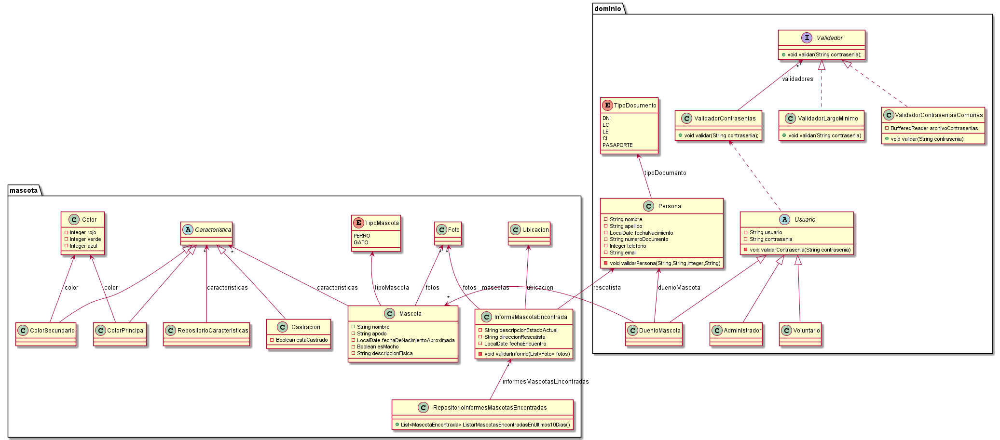

# TPA DDS 2021

## Diagrama de clases

<p align="center"> 

</p>

## Explicacion

* Para poder representar a las caracteristicas de las mascotas se eligio una lista de la clase 
  "Caracacteristica". La idea es que englobe un tipo, asi toda clase que herede de Caracteristica 
  pueda meterse en esa lista. Al momento de instanciar una Mascota, el administrador podría dejar 
  predefinido que elementos van a componer esa lista. Luego podría modificarla.
  

* Para representar fotos en el sistema, usamos la clase "Foto", aunque no sabemos si es correcto.


## Pseudocódigo

~~~
class Persona{
    String nombre;
    String apellido;
    LocalDate fechaNacimiento;
    TipoDocumento tipoDocumento;
    Long numeroDocumento;   //Alcanza con Integer?
    Integer telefono;
    String email;
    
    Persona(String nombre, String apellido, LocalDate fechaNacimiento, TipoDocumento tipoDocumento, 
    Long numeroDocumento, Integer telefono, String email){
        
        this.validarPersona(nombre, apellido, telefono, email);
        
        this.nombre = nombre;
        this.apellido = apellido;
        this.fechaNacimiento = fechaNacimiento;
        this.tipoDocumento = tipoDocumento;
        this.numeroDocumento = numeroDocumento;
        this.telefono = telefono;
        this.email = email;
    }
    
    public void validarPersona(String nombre, String apellido, Integer telefono, String email){
        if((nombre == null || apellido == null) && telefono == null && email == null){
            throw new PersonaInvalidaException("Debe ingresar como minimo <nombre y apellido>, <telefono> o <email>");
        }
    }
}

class DuenioMascota extends Persona{
    List<Mascota> mascotas;
    
    DuenioMascota(String nombre, String apellido, LocalDate fechaNacimiento, TipoDocumento tipoDocumento, 
    Long numeroDocumento, List<Mascota> mascotas, Integer telefono, String email){
        
        Super();
        this.mascotas = mascotas;
    }
}

class Rescatista extends Persona{
    String direccion; 
    
    Rescatista(String nombre, String apellido, LocalDate fechaNacimiento, TipoDocumento tipoDocumento, 
    Long numeroDocumento, String direccion, Integer telefono, String email){
        
        Super();
        this.direccion = direccion;
    }
}

enum TipoDocumento{
    DNI     //etc
}

class Mascota{
    TipoMascota tipoMascota      //permite agregar mas tipos a futuro. un loro por ejemplo?
    String nombre
    String apodo
    Integer edadAproximada
    Bool esMacho
    String descripcionFisica
    List<Foto> fotos        // clase Foto??
    List<Caracteristica> caracteristicas    //en la interfaz grafica el administrador puede 
                                            //decidir que Caracteristicas poner en la lista antes de pasar la lista 
                                            //por el constructor de Mascota
    
    Mascota(TipoMascota tipoMascota, String nombre, String apodo, Integer edadAproximada, Bool esMacho, 
    String descripcionFisica, List<Foto> fotos, List<Caracteristica> caracteristicas){
        this.tipoMascota = tipoMascota;
        this.nombre = nombre; 
        this.apodo = apodo; 
        this.edadAproximada = edadAproximada; 
        this.esMacho = esMacho; 
        this.descripcionFisica = descripcionFisica; 
        this.fotos = fotos; 
        this.caracteristicas = caracteristicas; 
    }
}

class MascotaEncontrada{
    List<Foto> fotos
    String descripcionEstadoActual
    Ubicacion ubicacion         //buscar como se comunican apis de mapas
    LocalDate fechaEncuentro
    
    MascotaEncontrada(List<Foto> fotos, String descripcionEstadoActual, Ubicacion ubicacion){
    
        if(fotos == null || fotos.isEmpty()){
            throw new MascotaEncontradaInvalidaException("Falta ingresar al menos una foto de la mascota encontrada");
        }
        this.fotos = fotos;
        this.descripcionEstadoActual = descripcionEstadoActual;
        this.ubicacion = ubicacion;
    }
}

enum TipoMascota{
    GATO, PERRO
    // esto permite agregar facilmente otro tipo de mascota
}

class Foto{
    //tiene sentido esta clase ??
}

class Caracteristica{
    // abstracta o interface?
}

class ColorPrincipal extends Caracteristica{
    Color color
}

class ColorSecundario extends Caracteristica{
    Color color
}

class Castracion extends Caracteristica{
    Bool estaCastrado
}

class Color{
    Integer rojo
    Integer verde
    Integer azul
}

class Ubicacion{
    // buscar como se comunican apis de mapas
}


//////////// 4to requerimiento -> Metodo magico
class RepositorioMascotasEncontradas{

    List<MascotaEncontrada> mascotasEncontradas;
    
    List<MascotaEncontrada> ListarMascotasEncontradasEnUltimosDias(Integer dias){
        return this.mascotasEncontradas.filter(
        mascota -> mascota.getFechaEncuentro().isAfter(LocalDate.now().minusDays(dias))
        )
    }
    
    List<MascotaEncontrada> ListarMascotasEncontradasEnUltimos10Dias(){
        return ListarMascotasEncontradasEnUltimosDias(10);
    }
}


////////// Requerimientos de seguridad

abstract class Usuario{
    String usuario
    String contrasenia
    
    Usuario(String usuario, String contrasenia){
    
        this.validarContrasenia(contrasenia);
        this.usuario = usuario;
        this.contrasenia = contrasenia;
    }
    
    void validarContrasenia(String contrasenia){
        ValidadorContraseniasComunes validador = new ValidadorContraseniasComunes();
        validador.validar(contrasenia);
    }
}

class UsuarioDuenioMascota extends Usuario{
    DuenioMascota duenioMascota
    
    UsuarioDuenio(String usuario, String contrasenia, DuenioMascota duenioMascota){
        super();
        this.duenioMascota = duenioMascota;
    }
}

class UsuarioAdministrador extends Usuario{
    
    UsuarioAdministrador(String usuario, String contrasenia){
        super();
    }
}

class ValidadorContraseniasComunes{
	
	public void validar(String contrasenia) {
	    try {
			BufferedReader archivoContrasenias = new BufferedReader(new FileReader("archivos/10k-most-common.txt"));
			for (int i = 1; i <= 10000; i++) {
			    if (archivoContrasenias.readLine().contentEquals(contrasenia)){
                    throw new contraseniaInvalidaException("Es una de las 10.000 contraseñas mas usadas");
                }
			}
		} catch (FileNotFoundException e) {
			throw new ArchivoException(
				"Algo salio mal al usar validar() en clase ValidadorContraseniasComunes", e);
		} catch (IOException e) {
			throw new ArchivoException(
				"Algo salio mal al usar validar() en clase ValidadorContraseniasComunes", e);
		}finally{
            try{                    
                if(archivoContrasenias != null){   
                   archivoContrasenias.close();     
                }                  
            }catch (Exception e){ 
                throw new ArchivoException(
				    "Algo salio mal al cerrar archivo en validar() en clase ValidadorContraseniasComunes", e);
            }
        }
	}
}


// requerimiento 7 - b ->> consultar ayudante
//podemos validar:
//minimo 8 caracteres
//usar salt(32 bits de longitud minimo) y hash
//etc...

~~~


# Validar el proyecto de forma exahustiva

```
mvn clean verify
```

Este comando hará lo siguiente:

 1. Ejecutará los tests
 2. Validará las convenciones de formato mediante checkstyle
 3. Detectará la presencia de (ciertos) code smells
 4. Validará la cobertura del proyecto

# Entrega del proyecto

Para entregar el proyecto, crear un tag llamado `entrega-final`. Es importante que antes de realizarlo se corra la validación
explicada en el punto anterior. Se recomienda hacerlo de la siguiente forma:

```
mvn clean verify && git tag entrega-final && git push origin HEAD --tags
```
